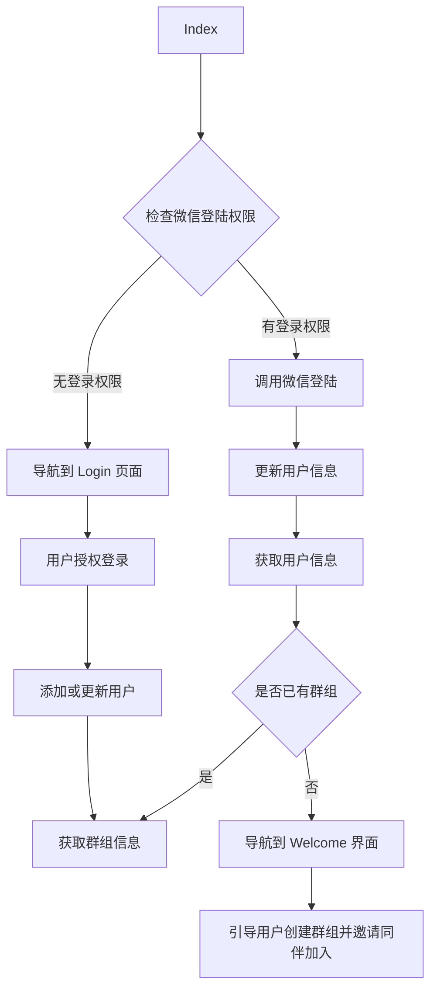

```mermaid
graph TD
A[Index] ---> B{检查微信登陆权限}
B -->|有登录权限| C[调用微信登陆]
B -->|无登录权限| D[导航到 Login 页面]
C --> E[更新用户信息]
E --> F[获取用户信息]
F --> G{是否已有群组}
G -->|是| H[获取群组信息]
G -->|否| I[导航到 Welcome 界面]
I --> J[引导用户创建群组并邀请同伴加入]
D --> K[用户授权登录]
K --> L[添加或更新用户]
L --> H
```
