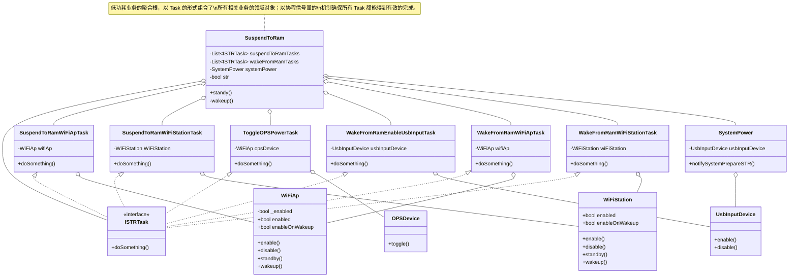
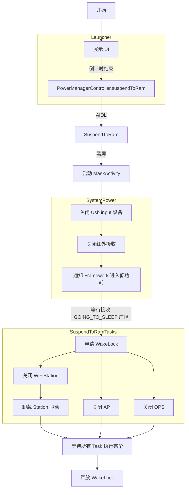

#低功耗 #STR #SuspendToRam

根据系统层低功耗的要求，应用在进入低功耗之前需要关闭 Ap、Station、卸载 WiFi 驱动、关闭 OPS、外源蓝牙语音、除湿，同时需要关闭 VOP、并且让接收卡、发送卡黑屏。
## 领域对象 UML 图

## 整体业务流程图

## 设计思想

**1. 任务管理：** `SuspendToRam` 类的工作管控整个进出低功耗的流程，并且在各个环节中管理任务的有序完成，并通过协程异步机制，和 WakeLock 机制确保任务均会妥善完成。

**2. 单一职责原则：** 整个方案都遵循单一职责原则。`SuspendToRam` 类负责管理设备休眠和唤醒过程。具体的任务则由其他领域对象执行。
